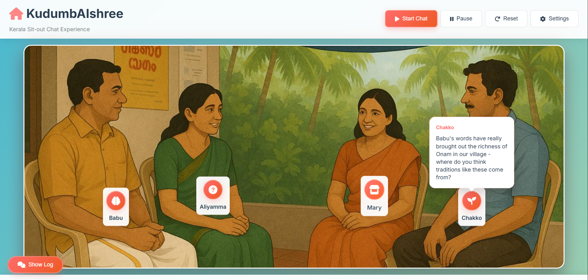

# 🏡 KudumbAIshree - Kerala Sit-out Chat Experience

A unique AI-powered chat application that simulates a traditional Kerala sit-out conversation with four distinct characters, each with authentic personalities and speech patterns. Experience authentic Kerala community conversations powered by local AI.



## ✨ Features

- **Interactive Kerala Sit-out Scene** - Visual representation of a traditional Kerala veranda
- **Local AI-Powered Conversations** - Uses Ollama with llama3.2:3b for privacy-focused AI
- **4 Distinct Characters** - Each with unique personalities and English speech patterns
- **Customizable Topics** - Choose from preset topics or create your own custom conversation topics
- **Real-time Conversation Flow** - Characters speak in natural rotation
- **Customizable Settings** - Adjust chat speed, response length, and AI usage
- **Conversation Logging** - Track the full conversation with timestamps and source indicators
- **Responsive Design** - Works seamlessly on desktop and mobile devices
- **Privacy-First** - All conversations processed locally with Ollama

## 👥 Characters

1. **🌾 Babu (Old Farmer)** - 65-year-old philosophical farmer who uses farming metaphors and speaks with deep wisdom from decades of working the land
2. **📚 Aliyamma (Retired Teacher)** - 58-year-old curious former Malayalam teacher who loves asking questions and turning conversations into learning moments
3. **👩‍👧‍👦 Mary (Young Mother)** - 32-year-old practical working mother focused on real-world solutions, time management, and family life
4. **🏪 Chakko (Shop Owner)** - 45-year-old storytelling shop owner who shares anecdotes about customers, local events, and community happenings

## 🚀 Installation & Setup

### Prerequisites
- **Python 3.8+** installed on your computer
- **Ollama** installed and running ([Download from ollama.ai](https://ollama.ai/))
- **Modern web browser** (Chrome, Firefox, Edge, Safari)
- **8GB+ RAM** recommended for optimal model performance

### Step-by-Step Setup

1. **Install Ollama and Download the Model**
   ```bash
   # 1. Install Ollama (visit ollama.ai and download for your OS)
   # 2. After installation, start Ollama (usually starts automatically)
   # 3. Pull the required model:
   ollama pull llama3.2:3b
   
   # Verify Ollama is running:
   ollama list
   ```

2. **Clone and Set Up the Project**
   ```bash
   # Clone the repository
   git clone https://github.com/yourusername/kudumbAIshree.git
   cd kudumbAIshree
   
   # Create and activate virtual environment (recommended)
   python -m venv .venv
   
   # On Windows:
   .venv\Scripts\activate
   
   # On Mac/Linux:
   source .venv/bin/activate
   ```

3. **Install Python Dependencies**
   ```bash
   cd backend
   pip install -r requirements.txt
   ```

4. **Start the Backend Server**
   ```bash
   # From the backend directory
   python app.py
   ```
   You should see: `🚀 Starting KudumbAIshree Backend API...`

5. **Launch the Frontend**
   ```bash
   # In a new terminal, from project root
   cd frontend
   python -m http.server 8080
   ```
   - Open your browser and go to `http://localhost:8080`
   - The application will automatically connect to the backend API

## 🎮 How to Use

1. **Start Conversation** - Click "Start Chat" to begin the AI-powered conversation
2. **Choose Topics** - Use the settings panel (⚙️) to:
   - Select from preset conversation topics
   - Create custom topics for specific discussions
   - Change between random or fixed topics
3. **Adjust Settings** - Configure:
   - Chat speed (1-15 seconds between messages)
   - Response length (short/medium/long)
   - Enable/disable AI responses
   - Test backend connection
4. **View Conversation** - Click "Show Log" to see the full conversation history with timestamps
5. **Control Chat** - Use Pause/Reset buttons to control the conversation flow
6. **Monitor AI Status** - Watch for 🤖 (AI) vs 📝 (Fallback) indicators in the conversation log

## 🏗️ Project Architecture

```
kudumbAIshree/
├── frontend/
│   ├── index.html          # Main application interface
│   ├── css/
│   │   └── styles.css      # Application styling
│   ├── js/
│   │   └── app.js          # Frontend logic and API communication
│   └── assets/
│       └── background.jpeg # Kerala sit-out background image
├── backend/
│   ├── app.py             # Flask API server with character definitions
│   └── requirements.txt   # Python dependencies
└── README.md              # Project documentation
```

## 🔧 Technical Architecture

### Backend (Python Flask)
- **Local AI Integration** - Seamless Ollama integration for privacy-focused conversations
- **Character Personalities** - Rich, detailed personality definitions for each character
- **Topic Management** - Flexible topic system with custom and preset options
- **Conversation Context** - Maintains conversation history for contextual responses
- **Graceful Fallbacks** - Character-appropriate fallback messages when AI is unavailable
- **CORS Support** - Enables frontend-backend communication

### Frontend (Vanilla JavaScript)
- **Real-time Communication** - Seamless backend integration with error handling
- **Character Rotation** - Proper turn-based conversation flow
- **Settings Management** - Persistent user preferences with topic customization
- **Visual Feedback** - Speech bubbles, animations, and status indicators
- **Responsive Design** - Mobile-friendly interface

### AI Integration
- **Local Ollama Processing** - Privacy-focused local AI with no data sent to external servers
- **Context Awareness** - Characters respond to previous messages in the conversation
- **Personality Consistency** - Each character maintains unique speech patterns
- **Graceful Fallbacks** - Character-appropriate responses when AI is unavailable

## 🛠️ Troubleshooting & Development

### Common Issues

**Backend Issues:**
- **Port 5000 in use**: Change the port in `backend/app.py` and update frontend API calls
- **Ollama connection errors**: 
  - Ensure Ollama is running: `ollama list`
  - Check if model is downloaded: `ollama pull llama3.2:3b`
  - Restart Ollama service if needed
- **Import errors**: Ensure virtual environment is activated and dependencies installed
- **Flask/CORS errors**: Check firewall settings and ensure Flask-CORS is installed

**Frontend Issues:**
- **No AI responses**: Open browser console (F12) to check for backend connection errors
- **Only fallback messages**: Verify Ollama is running and model is available
- **Characters speaking out of order**: Refresh the page and restart the chat
- **Settings not saving**: Check browser localStorage permissions

**Performance Issues:**
- **Slow responses**: Ensure adequate RAM (8GB+ recommended) for model execution
- **Model loading errors**: Try restarting Ollama and re-pulling the model
- **High CPU usage**: This is normal for local AI processing

### Development Setup

For developers who want to contribute or modify the project:

1. **Virtual Environment Setup**
   ```bash
   # Create isolated environment
   python -m venv .venv
   .venv\Scripts\activate  # Windows
   source .venv/bin/activate  # Mac/Linux
   ```

2. **Development Dependencies**
   ```bash
   cd backend
   pip install -r requirements.txt
   # For development, you might also want:
   pip install black flake8  # Code formatting and linting
   ```

3. **Project Structure Understanding**
   ```
   kudumbAIshree/
   ├── frontend/
   │   ├── index.html          # Main UI with sit-out scene
   │   ├── css/styles.css      # Responsive styling
   │   ├── js/app.js          # Frontend logic & API calls
   │   └── assets/            # Images and static files
   ├── backend/
   │   ├── app.py             # Flask API with Ollama integration
   │   └── requirements.txt   # Python dependencies
   └── README.md              # This file
   ```

4. **Making Changes**
   - Backend: Modify `backend/app.py` for API changes or character personalities
   - Frontend: Update `frontend/js/app.js` for UI logic or `frontend/css/styles.css` for styling
   - Characters: Edit character definitions in `backend/app.py` around lines 20-80

### Testing Your Changes

1. **Backend Testing**
   ```bash
   # Test API health endpoint
   curl http://localhost:5000/api/health
   
   # Test character response
   curl -X POST http://localhost:5000/api/chat \
        -H "Content-Type: application/json" \
        -d '{"character": "Babu", "topic": "farming"}'
   ```

2. **Frontend Testing**
   - Open browser developer tools (F12)
   - Check Console tab for JavaScript errors
   - Monitor Network tab for API call failures
   - Test on different screen sizes for responsiveness

## 🎯 Character Speech Patterns

Each character has distinctive speech patterns that make them unique:

- **Babu (Farmer)**: Uses agricultural metaphors, speaks about seasons, crops, and life cycles
- **Aliyamma (Teacher)**: Asks clarifying questions, shares educational insights, references books and learning
- **Mary (Mother)**: Practical advice, time management, family-focused, real-world solutions
- **Chakko (Shop Owner)**: Tells customer stories, discusses business, community events, local gossip

## 🚀 Contributing

1. Fork the repository
2. Create a feature branch: `git checkout -b feature-name`
3. Commit your changes: `git commit -am 'Add new feature'`
4. Push to the branch: `git push origin feature-name`
5. Submit a pull request

## 📄 License

This project is open source and available under the [MIT License](LICENSE).

## 🙏 Acknowledgments

- Inspired by traditional Kerala sit-out conversations
- Built with Ollama for privacy-focused local AI
- Character personalities based on authentic Kerala community archetypes

- **Babu**: "You know, in my experience..." / "There's something philosophical about..."
- **Aliyamma**: "Let me tell you something interesting..." / "Have you ever wondered why..."
- **Mary**: "What actually works is..." / "The practical thing to do is..."
- **Chakko**: "Let me tell you what happened..." / "You won't believe this story..."

## 🌟 Built For

Created for the "Useless Projects" Hackathon - celebrating the joy of building something fun and engaging that brings people together through technology. Sometimes the best projects are the ones that simply make people smile and feel connected to their culture and community.

## 📄 License

This project is open source and available under the MIT License.

---

**Enjoy your virtual Kerala sit-out experience!** 🏡✨

*Built with ❤️ for the "Useless Projects" Hackathon*